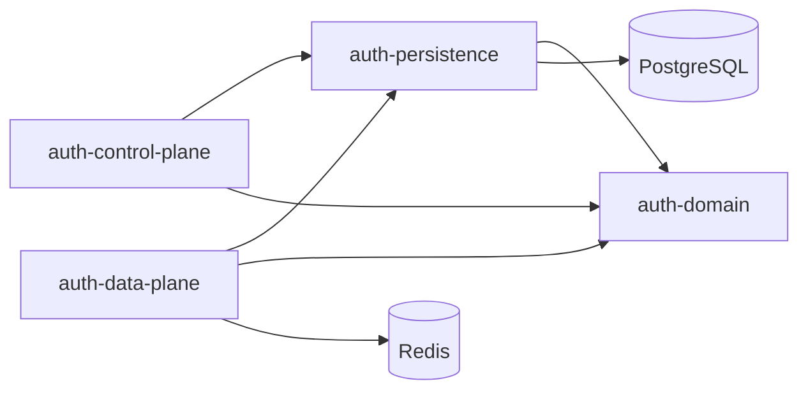

# Architecture

<p align="center">
  <a href="architecture.md"></a>
  <a href="../pt-BR/arquitetura.md"></a>
</p>

<p align="center">
  <a href="../../README.md"></a>
  <a href="product.md"></a>
  <a href="stack.md"></a>
  <a href="architecture.md"></a>
  <a href="roadmap.md"></a>
  <a href="getting-started.md"></a>
</p>

---

## High-level design

Auth SaaS separates **tenant administration** from **authentication traffic**.

```text
                 +----------------------+
                 |   Control Plane      |  onboarding, tenant admin
                 |   (deploy separate)  |  :8081
                 +----------+-----------+
                            | provision schema + config
                            v
                 +----------------------+
                 |  Platform database   |  tenant catalog
                 +----------+-----------+
                            |
        +-------------------+-------------------+
        v                   v                   v
  schema t_acme       schema t_globex     schema t_...
        ^                   ^
        +---------+---------+
                  | tenant routing
                  v
         +----------------------+
         |     Data Plane       |  login, tokens, JWKS, MFA
         |  (deploy separate)   |  :8080
         +----------+-----------+
                    |
                    v
                 Redis
```

<p align="center">
  
  
  
  
</p>

## Modules

| Module | Deployable? | Responsibility |
|---|---|---|
| `auth-domain` | No | Framework-agnostic contracts and models |
| `auth-persistence` | No | Platform + tenant persistence, schema routing, Flyway |
| `auth-control-plane` | Yes (`:8081`) | HTTP onboarding / admin API |
| `auth-data-plane` | Yes (`:8080`) | HTTP authentication / token API |



## Multi-tenancy model

| Phase | Model |
|---|---|
| **v1 (current)** | Schema-per-tenant on a shared PostgreSQL cluster |
| **Later** | Dedicated database on enterprise plans (same routing abstraction) |

Onboarding flow:

1. Validate slug / display name / admin credentials
2. Insert tenant in platform catalog
3. Create schema `t_<slug>`
4. Run tenant Flyway migrations
5. Seed admin identity + default auth provider configs

## Request routing (data plane)

Tenant is resolved from the path prefix:

```text
/t/{tenantSlug}/v1/auth/...
```

A filter loads the tenant, sets schema context, then auth providers and token services operate inside that tenant boundary.

## Security building blocks

| Concern | Approach |
|---|---|
| Passwords | Argon2id |
| Access tokens | JWT (signed), exposed via JWKS |
| Refresh tokens | Opaque tokens in Redis, rotate on use, revoke on logout |
| Control plane access | HTTP basic (platform admin) for v1 onboarding |
| Provider flags | Per-tenant `auth_provider_configs` (enable/disable methods) |

## Related pages

- [Stack](stack.md)
- [Roadmap](roadmap.md)
- [ADR-001](adr/ADR-001-stack-and-architecture.md)

<p align="center">
  <a href="architecture.md"></a>
  <a href="../pt-BR/arquitetura.md"></a>
</p>
