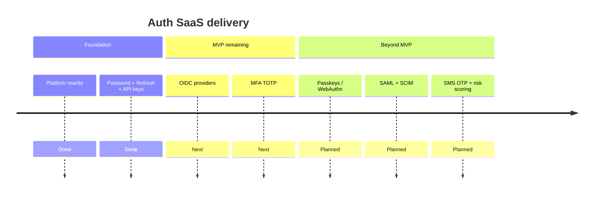

# Roadmap

  
  

  
  
  
  
  
  

---

## Where we are

Foundation rewrite is **merged on `main`**: multi-module Auth SaaS with control plane, data plane, schema-per-tenant, and core auth APIs.

  
  
  

---

## MVP v1 — authentication checklist

Aligned with [ADR-001](adr/ADR-001-stack-and-architecture.md).

| # | Capability | Status | Notes |
|---|---|---|---|
| 1 | Password (Argon2id) | Done | Login endpoint live |
| 2 | Refresh token (rotating) + revoke | Done | Redis-backed |
| 3 | OIDC / OAuth2 (Google, Microsoft, custom IdP) | Next | `OidcStubController` returns 501 |
| 4 | API keys (machine clients) | Done | API key login live |
| 5 | MFA TOTP | Next | `MfaTotpStubController` returns 501 |

### Platform foundation (also delivered)

| Capability | Status |
|---|---|
| Gradle multi-module under `com.auth.saas` | Done |
| Control plane tenant onboarding | Done |
| Schema-per-tenant + Flyway provisioning | Done |
| JWKS endpoint | Done |
| Docker Compose (Postgres + Redis) | Done |
| CI (Corretto 25) | Done |
| Bilingual docs + ADR-001 | Done |

---

## Next iteration (immediate)

| Item | Goal |
|---|---|
| **OIDC authorization-code flow** | Real `/oauth2/{provider}/authorize` + callback, IdP config per tenant |
| **MFA TOTP** | Enroll + verify using `mfa_totp_secrets`, gate login when enabled |

These replace the scaffolded 501 stubs in the data plane.

---

## Post-MVP roadmap

| Theme | Items |
|---|---|
| Strong auth | Passkeys / WebAuthn |
| Enterprise federation | SAML |
| Alternative MFA | SMS OTP |
| Directory sync | SCIM |
| Adaptive security | Risk scoring |
| Tenancy scale-out | Dedicated database per enterprise tenant |

---

## Status legend

| Badge meaning | Description |
|---|---|
| **Done** | Implemented and wired in the APIs |
| **Next** | Explicit next engineering iteration |
| **Later / Planned** | Product roadmap after MVP completion |

  
  

