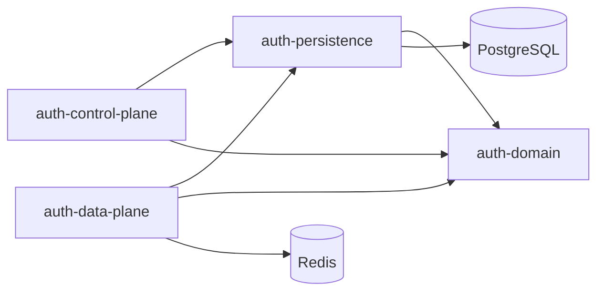

# Arquitetura

<p align="center">
  <a href="../en-US/architecture.md"></a>
  <a href="arquitetura.md"></a>
</p>

<p align="center">
  <a href="README.md"></a>
  <a href="produto.md"></a>
  <a href="stack.md"></a>
  <a href="arquitetura.md"></a>
  <a href="roadmap.md"></a>
  <a href="primeiros-passos.md"></a>
</p>

---

## Desenho de alto nível

Auth SaaS separa **administração de tenants** do **tráfego de autenticação**.

```text
                 +----------------------+
                 |   Control Plane      |  onboarding, admin de tenant
                 |   (deploy separado)  |  :8081
                 +----------+-----------+
                            | provisiona schema + config
                            v
                 +----------------------+
                 |  Banco platform      |  catálogo de tenants
                 +----------+-----------+
                            |
        +-------------------+-------------------+
        v                   v                   v
  schema t_acme       schema t_globex     schema t_...
        ^                   ^
        +---------+---------+
                  | roteamento por tenant
                  v
         +----------------------+
         |     Data Plane       |  login, tokens, JWKS, MFA
         |  (deploy separado)   |  :8080
         +----------+-----------+
                    |
                    v
                 Redis
```

<p align="center">
  
  
  
  
</p>

## Módulos

| Módulo | Deployável? | Responsabilidade |
|---|---|---|
| `auth-domain` | Não | Contratos e modelos agnósticos de framework |
| `auth-persistence` | Não | Persistência platform + tenant, roteamento de schema, Flyway |
| `auth-control-plane` | Sim (`:8081`) | API HTTP de onboarding / admin |
| `auth-data-plane` | Sim (`:8080`) | API HTTP de autenticação / tokens |



## Modelo multi-tenant

| Fase | Modelo |
|---|---|
| **v1 (atual)** | Schema-por-tenant em um cluster PostgreSQL compartilhado |
| **Depois** | Database dedicado no plano enterprise (mesma abstração de roteamento) |

Fluxo de onboarding:

1. Validar slug / nome / credenciais do admin
2. Inserir tenant no catálogo platform
3. Criar schema `t_<slug>`
4. Rodar migrations Flyway do tenant
5. Semear identity admin + configs default de providers

## Roteamento de request (data plane)

O tenant é resolvido pelo prefixo de path:

```text
/t/{tenantSlug}/v1/auth/...
```

Um filtro carrega o tenant, define o contexto de schema e então providers/tokens operam dentro dessa fronteira.

## Blocos de segurança

| Preocupação | Abordagem |
|---|---|
| Senhas | Argon2id |
| Access tokens | JWT assinado, exposto via JWKS |
| Refresh tokens | Tokens opacos no Redis, rotacionam no uso, revoke no logout |
| Acesso ao control plane | HTTP basic (platform admin) no onboarding v1 |
| Flags de provider | `auth_provider_configs` por tenant (liga/desliga métodos) |

## Páginas relacionadas

- [Stack](stack.md)
- [Roadmap](roadmap.md)
- [ADR-001](adr/ADR-001-stack-and-architecture.md)

<p align="center">
  <a href="../en-US/architecture.md"></a>
  <a href="arquitetura.md"></a>
</p>
