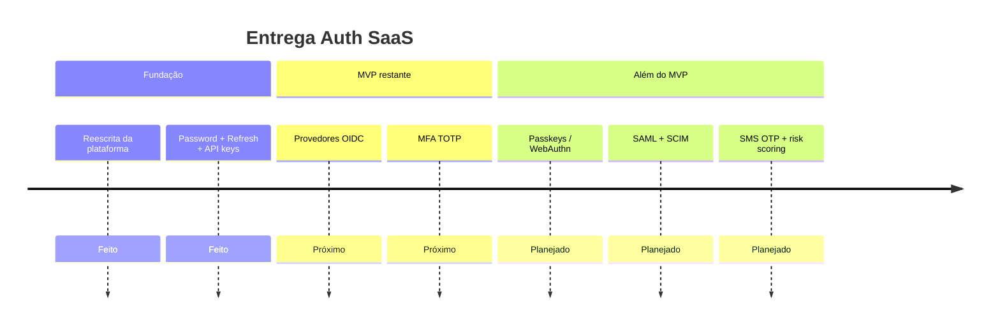

# Roadmap

  
  

  
  
  
  
  
  

---

## Onde estamos

A reescrita da fundação está **mergeada em `main`**: Auth SaaS multi-módulo com control plane, data plane, schema-por-tenant e APIs core de auth.

  
  
  

---

## MVP v1 — checklist de autenticação

Alinhado com o [ADR-001](adr/ADR-001-stack-and-architecture.md).

| # | Capacidade | Status | Notas |
|---|---|---|---|
| 1 | Password (Argon2id) | Feito | Endpoint de login ativo |
| 2 | Refresh token (rotativo) + revoke | Feito | Baseado em Redis |
| 3 | OIDC / OAuth2 (Google, Microsoft, IdP custom) | Próximo | `OidcStubController` retorna 501 |
| 4 | API keys (clientes máquina) | Feito | Login por API key ativo |
| 5 | MFA TOTP | Próximo | `MfaTotpStubController` retorna 501 |

### Fundação da plataforma (também entregue)

| Capacidade | Status |
|---|---|
| Gradle multi-módulo sob `com.auth.saas` | Feito |
| Onboarding de tenant no control plane | Feito |
| Schema-por-tenant + provisioning Flyway | Feito |
| Endpoint JWKS | Feito |
| Docker Compose (Postgres + Redis) | Feito |
| CI (Corretto 25) | Feito |
| Docs bilingues + ADR-001 | Feito |

---

## Próxima iteração (imediata)

| Item | Objetivo |
|---|---|
| **Fluxo OIDC authorization-code** | `/oauth2/{provider}/authorize` + callback reais, config de IdP por tenant |
| **MFA TOTP** | Enroll + verify usando `mfa_totp_secrets`, exigir no login quando habilitado |

Isso substitui os stubs 501 scaffoldados no data plane.

---

## Roadmap pós-MVP

| Tema | Itens |
|---|---|
| Auth forte | Passkeys / WebAuthn |
| Federação enterprise | SAML |
| MFA alternativa | SMS OTP |
| Sync de diretório | SCIM |
| Segurança adaptativa | Risk scoring |
| Escala de tenancy | Database dedicado por tenant enterprise |

---

## Legenda de status

| Significado | Descrição |
|---|---|
| **Feito** | Implementado e ligado nas APIs |
| **Próximo** | Próxima iteração explícita de engenharia |
| **Depois / Planejado** | Roadmap de produto após o MVP |

  
  

